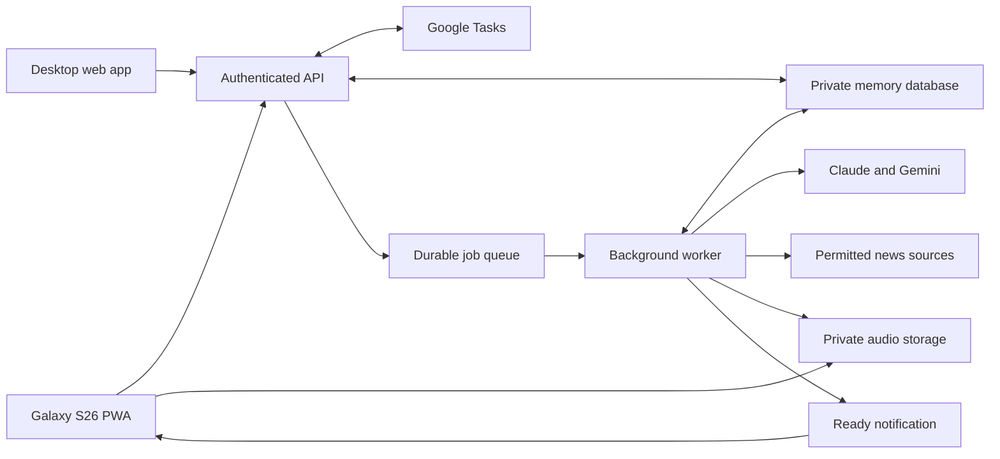

# Second Brain: implementation plan

Prepared 7 September 2026 from the project review and the user's interview answers. This document supersedes the provisional architecture and retention recommendations in `SECOND_BRAIN_DISCOVERY.md`. It specifies a new application; implementation, account creation and deployment have not started.

## 1. Product decision

Build a personal, installable web application for a Samsung Galaxy S26 and desktop browsers. Its primary outcome is helping the user choose and complete useful actions. Emotional support, strategic thinking, relationships and relevant news support that outcome.

The daily loop is: capture a thought, retain an editable understanding, consider current Google Tasks, choose useful actions, then listen to a coherent briefing. The adviser should be warm and direct, challenge avoidance, and explain its reasoning using actual information the user supplied. It must not invent personal history to sound insightful.

The existing task application remains usable in parallel. Google Tasks continues to own the user's actions and existing checklist subtasks. The new application owns its private memory, conversations in progress, action proposals and audio episodes.

### Confirmed requirements

| Area | Decision |
| --- | --- |
| Device | Galaxy S26, Android Chrome installed PWA; desktop web access |
| Recording | Foreground recording is sufficient; typed capture also supported |
| Playback | Must work while locked, including during a run or commute |
| Generation | On demand only; no scheduled morning generation |
| Typical session | About 10 minutes; often around 7 am or 9 am |
| Ready time | Target a completed episode within five minutes, followed by a notification |
| Audio composition | Checkboxes for topics, adjustable total duration, saved mixes and bespoke subjects |
| Initial content | Daily priorities, motivation, strategy, emotional reflection, relationships, news |
| Voice | English-speaking woman's voice; audition British English as an initial preference, make accent selectable |
| News | AI, geopolitics and local Melbourne news; include understanding of the world, not only immediate decisions |
| Task authority | Generate ideas freely; get confirmation before adding every new task |
| Memory | Automatically extract understanding; optional review and direct correction |
| Storage | Secure private cloud, accessible from both devices |
| History import | No import of old coaching conversations or summaries |
| Temporary conversation | A mode that does not update long-term memory |
| AI providers | Claude preferred for advice, Gemini for audio/news processing; selectable supported providers and models |
| Budget | A$20 per month |

### Planning assumptions

The budget includes hosting and AI, excludes development labour, and covers one person. The default timezone is `Australia/Melbourne`. There is no paid custom domain requirement. A future public or multi-user service is outside this implementation.

Recordings and transcripts are processing inputs, not a permanent journal. By default, delete them from active application storage after successful memory extraction. An optional 24-hour transcript correction window can be enabled later. Until a preference is selected, that option is off. Failed processing has a short retry window, described in section 5.

Generated briefing scripts and audio are outputs, not input transcripts. Keep them for seven days by default, allow explicit pinning, and provide an immediate Delete action. This is configurable and visible in settings.

## 2. What the first complete release includes

Five main areas: **Today, Capture, Listen, Memory and Adviser**. Settings is accessible from the account button. A persistent compact audio player sits above navigation. Desktop uses a sidebar and wider reading panels; the same data and workflows work on both devices.

Calories, old per-task Gemini chat panels, routine/calorie history import, calendar access, email access, contact scraping, automatic messages to other people and autonomous task creation are excluded. Voice input and spoken responses are included as recorded turns; an always-open realtime voice call is not required.

### Today

Show the chosen Google task lists, native parent/child hierarchy where present, existing checklist subtasks, due dates, completion controls, and list order. Show last successful synchronization and a refresh action. A small focus panel proposes up to three actions with short reasons; it is visually separate from the user's actual task order.

Show pending action proposals, an unfinished capture, and the most recent episode. The primary buttons are Record and Create audio. Do not make a daily check-in questionnaire a prerequisite for use.

A proposal has a title, optional notes, destination list, optional due date, link to an existing goal/person/issue, and its reason. The user can edit, accept or dismiss it. Dismissal can optionally explain why, providing an explicit learning signal rather than treating non-response as rejection.

### Capture

One tap opens recording; microphone permission is requested when first needed. Show recording state, elapsed time, audio level, pause/resume, stop and discard. Foreground recordings should support at least 15 minutes, with a configurable initial maximum of 30 minutes to bound processing cost.

After Stop: Uploading -> Understanding -> Saved as memories. Allow navigation after durable upload acknowledgement. Network loss leaves a clearly labelled local pending capture, not a false Saved status.

The result card says what was added or changed, what remains uncertain and which actions were suggested. The user may open it or ignore it. Edits update memories directly; they do not require a new LLM call. An ambiguous person reference can remain unlinked until clarified.

Provide typed capture and a visible switch between Remember useful details and Temporary conversation. Make the selected mode unmistakable before recording starts.

### Listen

The composer offers these content modules:

| Module | Default weight when included | Intended output |
| --- | --- | --- |
| Daily priorities | 2 minutes | Most useful next actions from current tasks, with practical first steps |
| Motivation | 1 minute | Specific encouragement connected to goals, progress and current obstacles |
| Strategic review | 3 minutes | Goal/action alignment, neglected decisions and useful trade-offs |
| Emotional reflection | 2 minutes | Calm exploration of a selected concern, followed by a manageable next step |
| Relationships | 2 minutes | Relevant recent changes, unresolved concerns and possible constructive actions |
| News | 3 minutes | AI, geopolitical and Melbourne developments with context and sources |
| Custom subject | User-entered | A focused topic, such as preparing for a difficult conversation |

These weights allocate the chosen total; they are not mandatory additional minutes. Selecting priorities + motivation + strategy gives a six-minute preset. Selecting a ten-minute mix scales the allocation and reserves space for transitions and a short close. If one minute is selected with every module, explain that it is a very brief overview; do not imply each module can be explored deeply.

Offer 1, 3, 6, 10 and 15 minutes plus a bounded custom duration. Save mixes such as Morning focus, Run encouragement, Big-picture reset and World briefing. Custom instructions are saved as a template only when requested. A one-off custom subject is temporary processing data and is not automatically a memory.

The composer displays estimated cost, current month usage, selected model preset, intended duration and whether current Tasks/news are available. Generation starts by refreshing Tasks. Checkboxes select source scope; a news-only episode must not include relationship history.

Show job stages without invented percentages: Syncing tasks, Preparing advice, Creating voice, Finishing audio. Only show measurable chunk counts during speech generation. Completion generates one playable file. Do not require progressive streaming to meet the first release.

The library shows actual duration, generated time, content mix, model preset, task synchronization time, download state and playback progress. The episode detail contains the written script, chapter markers, public news sources, and links to supporting stored memories. Private memory links are not verbatim-source citations once transcripts are deleted.

### Memory

Browse Goals, People, Relationships, Issues and risks, Decisions, Preferences and Recent changes. Search by name, topic and meaning. Every record has a readable description, time context, status and Edit/Delete actions.

A person page shows the user's relationship to that person, linked events, unresolved concerns and latest confirmed context. It does not display a model-generated personality score. A goal page links aspirations to current tasks and proposed actions. An issue page distinguishes what the user reported from what the assistant suspects.

“What I learned” changes can be accepted, edited, marked uncertain, dismissed or removed. Corrections take priority over earlier AI interpretations. A merge/split control handles two people sharing a name or one person with multiple aliases.

### Adviser

One consistent assistant, with modes such as Help me act, Think strategically, Talk this through and Challenge my assumptions. Text and recorded voice turns share the same retrieval and action-proposal pipeline. A Play response action is available; short chat replies are not automatically synthesised and charged.

Standard conversations extract useful memories, then expire their raw text according to the retention policy. Continuity comes from memories rather than an endless stored chat transcript. The interface clearly explains this. Temporary conversations can consult existing context if the user leaves that switch on, but cannot modify it. They cannot call task-write tools; an explicit transition to a separately confirmed task proposal is required.

### Settings

Google connection and selected lists; private memory controls; voice and accent; audio presets; supported providers/models; budget; notification permission and test; devices/sessions; export/delete; data retention; theme and accessibility. Provider credentials are set through an authenticated, write-only connection form, never returned to the browser after saving.

## 3. Recommended technical architecture

Use a React + TypeScript + Vite frontend on GitHub Pages and a small Google Cloud backend. Google Cloud is a recommendation based on the budget and existing Google integration, not a requirement imposed by the PWA format.

| Component | Recommended service | Purpose |
| --- | --- | --- |
| Frontend | GitHub Pages | Familiar static deployment and browser installation |
| Account sign-in | Firebase Authentication with Google | Identity and sessions; only the owner's allowed UID can use the backend |
| HTTP API | Cloud Run, TypeScript/Node | Validate identity, serve data, control Tasks access, create jobs |
| Background worker | Private Cloud Run service | Transcription, extraction, briefings, speech assembly and cleanup |
| Durable dispatch | Cloud Tasks | Jobs continue when the phone closes; retry failed stages |
| Database | Firestore | Memories, relationships, task references, proposals, jobs, settings and usage |
| Similarity search | Firestore vector index | Retrieve relevant stored memories without another database subscription |
| Files | Private Cloud Storage buckets | Temporary capture processing and completed audio |
| Secrets | Secret Manager | Model keys, OAuth secret, refresh-token encryption key and push signing key |
| Notification | Standard Web Push with VAPID | Deliver a generic ready notification to the installed PWA |
| Cleanup/recovery | Cloud Tasks plus a small periodic maintenance trigger | Remove expired data and repair interrupted job dispatch |

The public API and private worker use the same shared domain library but separate service identities. The worker endpoint accepts authenticated queue dispatch, not arbitrary public jobs. Every backend operation derives the owner from a validated session; an `ownerId` supplied by the browser is never trusted.

Cloud Run and Cloud Tasks support this asynchronous arrangement: [Cloud Run task integration](https://docs.cloud.google.com/run/docs/triggering/using-tasks). Firestore provides server-side vector queries: [Firestore vector search](https://firebase.google.com/docs/firestore/vector-search). Use a supported embedding dimension, initially 768, and version the embedding model.



Use an Australian storage region, preferably `australia-southeast1` if supported by every selected regional service. Region choice applies to primary application storage; it does not promise Australian-only processing by every AI provider or push service.

Start with minimum instances zero, a low maximum instance count, request-based billing, bounded worker concurrency and no permanent cache server. Use object storage for audio rather than embedding large binary data in database records. Fixed-price managed PostgreSQL remains an alternative if the budget increases; [Supabase Pro starts at US$25/month](https://supabase.com/pricing), which does not fit this total budget.

### Repository structure

```text
second-brain/
  apps/web/                  React screens, persistent player, service worker
  apps/api/                  HTTP routes, identity, Google OAuth, Tasks proxy
  apps/worker/               Durable processing stages and media assembly
  packages/domain/           Memory, proposals, task compatibility, schemas
  packages/providers/        Claude, Gemini, Google TTS, optional OpenAI, news
  packages/contracts/        Shared request/response and validation schemas
  infra/                     Deployment config, IAM, queues, indexes, lifecycle
  tests/fixtures/            Synthetic tasks, memories and provider outputs
  tests/integration/         Queue, retention, auth and Tasks behaviour
  docs/                      Setup, recovery, usage and acceptance checklist
  .github/workflows/         Checks, frontend deploy, backend deploy
```

Pin dependency versions at implementation time. Use one package-manager lockfile. Do not automatically update providers or model aliases without an evaluated configuration change.

## 4. Authentication, installation and notifications

Account sign-in and permission to access Google Tasks are separate concerns. Firebase proves who is using the application. A dedicated Google OAuth client obtains Tasks authorization for the backend, using an authorization-code flow, a state value bound to the session, exact redirect URIs, and protected refresh tokens. Use PKCE where supported by the chosen client flow.

Request only the required identity and Tasks scopes. The new app uses its own OAuth client so disconnecting it does not deliberately revoke the old app's grant. Save a returned refresh token atomically; a refresh response lacking a replacement must not erase the existing one. Handle revoked tokens with a visible Reconnect Tasks state while retaining access to memories.

Google documents [offline authorization](https://developers.google.com/identity/protocols/oauth2/web-server) and [seven-day refresh-token expiry for relevant external Testing apps](https://developers.google.com/identity/protocols/oauth2). Deployment must configure a suitable publishing state for personal use and check the actual consent/verification requirements; do not promise perpetual unattended access while leaving the app in Testing.

For GitHub Pages, use the new repository base path consistently in asset URLs, manifest `id`, `start_url`, `scope`, icons and service worker. Include 192px/512px PNG and maskable icons. Use hash routes to avoid deep-link 404s. Give caches and IndexedDB databases unique names; an old and new project on the same `github.io` origin share an origin even if paths differ.

Use the standard Push API with the existing app-scoped service worker, avoiding a second worker that assumes ownership of the domain root. Ask for permission when the user enables Ready notifications. A server VAPID key signs sends; the browser stores a subscription, which is owner/device-bound in the backend. See [Push subscription documentation](https://developer.mozilla.org/en-US/docs/Web/API/PushManager/subscribe).

After the final audio object is committed and the episode status is Ready, enqueue a notification. The notification contains a generic title and an episode identifier, not private advice or a signed audio URL. Clicking opens the existing app window or the episode's hash route. Notification failure does not mark audio generation failed or trigger generation again.

Delivery is best effort under Android network, Do Not Disturb and battery policies. The episode library always provides a fallback. Test on the actual Galaxy S26. Do not assume a push message can download an entire episode while the browser is asleep. Ready means generated on the server; Downloaded means verified on that device.

## 5. Memory without a permanent transcript archive

### Retention contract

| Data | Default retention | Handling |
| --- | --- | --- |
| Local recording chunks | Until successful durable upload/extraction acknowledgement; abandoned drafts have visible expiry | Never silently evict an unsent capture to make space |
| Uploaded original recording | Delete after successful extraction; otherwise at most 60 minutes after final upload | Retry within the window; on expiry ask for a new capture |
| Machine transcript | Process temporarily, delete after extraction | Optional 24-hour correction window, off by default |
| Raw standard chat turns | Current session/processing only | Distil useful memories, then purge; no permanent chat archive |
| Temporary conversation | Current session only; server working data has a 60-minute maximum | No profile, memory, embedding or proposal writes |
| Structured memories | Until edited/deleted | Retain dated changes, not raw source transcripts |
| Briefing script/audio | Seven days, unless pinned | A personal output; delete and unpin controls |
| Task snapshots | Short-lived operational copies | No import of old coaching text into memory; strip it from stored snapshots |
| Job telemetry | Thirty days | IDs, stages, timing, model, token counts, cost and error category only |
| Memory backup | Seven daily recovery copies | Exclude transient data; deletions reapplied before restoring service |

Temporary raw material must not enter normal database backups, analytics, tracing, queue payloads or exception strings. A durable queue message carries IDs, not transcripts. Disable object versioning and soft delete on the transient bucket; otherwise an apparent deletion may retain recoverable copies. Cloud Storage's default can include seven days of soft deletion: [soft-delete documentation](https://docs.cloud.google.com/storage/docs/soft-delete).

Explicit deletion is the primary mechanism. Expiration metadata and a scheduled sweeper are a fallback, not a promise that an asynchronous database TTL runs at an exact instant. The API refuses access after expiry even if physical cleanup is delayed. Record deletion completion without retaining deleted content.

Temporary mode excludes content from long-term application storage. It does not claim zero provider retention. Paid Gemini processing has separate handling from unpaid service usage; its provider retention must be disclosed accurately: [Gemini data terms](https://ai.google.dev/gemini-api/terms). The UI needs a brief explanation, not a legal checklist.

### What is preserved

Preserve paraphrased facts, intentions, events, goals, perceived relationship changes, explicit preferences and useful decisions. Each has an observation timestamp, any separately known event date, epistemic label and provenance record. Provenance describes the capture and extraction version; once the source is purged it must say Source transcript not retained.

Distinguish `user_reported`, `user_confirmed`, `assistant_hypothesis` and `user_corrected`. These are meaningful statuses; do not display made-up numerical confidence as measured truth. A worry such as “I might lose my job” is a concern, not an employment-status change. A conditional plan is not a commitment. An assistant recommendation is never evidence that the user acted.

No claim of perfect memory is possible with this policy. Details omitted during extraction cannot later be recovered. Do not fabricate quotations from a paraphrased memory. The user can correct the memory, but the app cannot replay a source that was intentionally deleted.

### Write pipeline

1. Persist local chunks during recording with a capture ID and sequence numbers.
2. Upload using an owner-bound, size-limited session; validate byte count and media format.
3. Acknowledge durable receipt before allowing local cleanup. Create a processing job transactionally.
4. Transcribe temporarily, keeping names/negation/uncertainty explicit; flag unclear passages.
5. Retrieve a small set of relevant existing entities/memories to distinguish an addition from an update.
6. Extract a schema-validated candidate changeset. Require source-span support while the transcript exists; reject unsupported entity/status claims.
7. Resolve aliases conservatively. Preserve ambiguity instead of merging two people solely by name.
8. Commit candidate memories and changes in a transaction with expected versions. Human-edited fields win; conflicting updates become review items.
9. Save action proposals separately. No new task is created here.
10. Update affected entity summaries and embedding records, avoiding a full profile rewrite on every capture.
11. Purge source material according to retention and report What I learned.

Extraction failure never creates partially guessed memories. Preserve a retryable input only for its stated short window. A repeated callback uses the same capture/change identifiers and cannot duplicate memories.

### Read pipeline

Select a bounded context from current profile, recent changes, goal/issue records, entity matches and relevant semantic matches. Add an explicit search for contradictory or newer records. For an action-oriented response, include current task state and the user's task order. For news-only requests, skip private retrieval entirely.

Keep a mandatory small set of pinned active goals and unresolved high-priority issues so a broad strategic question does not depend only on keyword similarity. Filter deleted, expired and superseded records before ranking. Use lexical name/alias matches and date filters alongside vector similarity.

A provisional routine briefing input budget is 6,000 tokens. Retrieve all Tasks first, but send selected task detail to the model: names/order/due state for a bounded relevant set, detailed context for today's focus, and counts for the rest. If the full chosen scope cannot fit, expose that limitation or select a deliberately larger budget; do not quietly claim every task was considered in detail.

## 6. Logical data model

Use owner-scoped Firestore collections. IDs are random and stable; timestamps are server-generated UTC values, with date-only due dates and a separate user timezone. All mutable entities have `version`, `createdAt`, `updatedAt` and optional `deletedAt`. Keep records small and separately queryable.

| Collection | Important fields and constraints |
| --- | --- |
| `users` | UID, timezone, allowed lists, retention choices, voice preference, budget; one active owner initially |
| `connections` | Provider/account type, encrypted refresh credential or secret reference, granted scopes, expiry, status; never client-readable |
| `devices` | Owner, push subscription, last seen, revoked flag; remove invalid subscriptions |
| `captures` | Mode, upload state, temporary object refs, expiry, processing stage; raw text excluded after purge |
| `memories` | Kind, readable text, epistemic status, event date, observed date, entity IDs, goal/task links, review state, source-retained flag |
| `memory_changes` | Record ID, previous/next structured values, reason and version; owner deletion removes content across versions |
| `people` | Display name, aliases, user-defined relationship, current summary, supporting memory IDs |
| `relationships` | Entity pair, user-reported status, dated event IDs, open concerns; no inferred personality score |
| `goals` | Desired outcome, why it matters, horizon, success definition, status, linked task refs |
| `issues` | Issue/risk/opportunity, current understanding, possible impact, controllable actions, status, supporting memory IDs |
| `decisions` | Question, considered options, user's decision, rationale, review date if requested |
| `profile_versions` | Small current synthesis, dependency memory IDs/versions, generation version; invalidate on correction/deletion |
| `memory_vectors` | Memory ID, owner, embedding, embedding model/version; never a second independent fact store |
| `task_refs` | Google account, list ID, task ID, parent, position, due/status and observation time; include only selected operational fields |
| `task_proposals` | Operation, proposed values, target list/task, rationale, base version/hash, approval status and resulting Google ID |
| `briefing_templates` | Modules/weights, duration, custom instructions, permitted context scope, model preset |
| `jobs` | Kind, owner, stage, lease, idempotency key, attempts, cancellation, timestamps, cost reservation |
| `job_steps` | Job, step key, input/output version hashes, completed artifact ref, bounded attempts |
| `episodes` | Script, audio ref/checksum, measured duration, chapters, source links, context versions, model/prompt versions, retention, state |
| `usage_ledger` | Provider, model, tokens/seconds/searches, estimated/actual cost, currency, reservation state and job ID |
| `deletion_records` | Opaque deleted IDs and deletion time, no personal text; used during restoration |

Use composite indexes for owner + kind/status + updated time, people aliases, task composite keys, pending proposals, and jobs by status/lease. Vector queries prefilter owner and active status. User queries may never retrieve other owners' data even if another account signs in.

Keep task proposal approval transitions and cost reservations transactional. A unique idempotency record prevents accepting the same proposal twice. Google task creation itself is outside the database transaction, so reconciliation is needed for ambiguous remote outcomes.

## 7. Google Tasks compatibility while both apps are used

The compatibility contract is stronger than simply reading a task title. Preserve task IDs, list IDs, user notes, description delimiters, unknown metadata keys, checklist item IDs, titles, order and completion state. Copy the existing metadata format from the reference implementation into a well-tested compatibility module; do not retype delimiters from screenshots or terminal-encoding output.

Read all pages of lists and tasks, preserving native `parent` and sibling order. Support both native Google subtasks and existing embedded checklists as distinct representations. Do not automatically convert or duplicate one into the other.

Store no psychological memory, relationship history, AI reasoning or full conversation text inside Google task notes. Routine status/title/due updates patch only those native fields. A checklist edit reads the latest raw notes and applies the smallest required metadata edit while preserving unrecognized content. Do not reuse the old history-compaction routine for new private memory.

Use composite keys `(googleAccountId, listId, taskId)`. Handle completed/hidden/deleted tasks, deleted lists, and native task moves. Store due dates as date-only values, not midnight converted to Melbourne time. Google documents hierarchy and date semantics in the [task resource](https://developers.google.com/tasks/reference/rest/v1/tasks), and pagination/filtering in [tasks.list](https://developers.google.com/tasks/reference/rest/v1/tasks/list).

Refresh on launch, foreground return, user refresh and before a briefing snapshot. Poll modestly while the Tasks view is active, for example every 60 seconds. No overnight task polling is required for on-demand-only generation. Use `updatedMin` with overlap and periodic full reconciliation if incrementals are introduced; don't assume a Calendar-style sync token or a Tasks webhook exists.

### Write authority

| Action | Behaviour |
| --- | --- |
| AI notices a possible action | Save a proposal; do not create a Google task |
| User says “add a task” in chat | Show a prefilled confirmation card; new tasks still require acceptance |
| User accepts a new task | Create it once, then show the resulting Google task |
| User directly ticks a task/subtask | Execute the explicit action and verify the result |
| AI suggests a due-date/order change | Present a proposal; preserve user order until accepted |
| Delete a task | Require an explicit user deletion action and confirmation |
| Relationship advice | Suggest actions; never message another person |

Read live state before writes and compare it with the proposal's base state. Use conditional updates if the Tasks API and operation support them, verified by an integration probe; don't assume an exposed ETag is sufficient. After writes, re-read and reconcile. If a create times out after Google may have committed it, mark Outcome uncertain and inspect recent candidates; never blindly re-POST and risk duplicates.

There is an unavoidable limitation: the old app does not coordinate transactions with this app. An old client can still overwrite notes after the new app writes. Minimal patches, conflict detection and verification reduce this risk but cannot guarantee perfect simultaneous editing without updating both clients. Test sequential alternation thoroughly; document avoiding simultaneous edits of the same checklist. An optional future compatibility patch to the old app is separate work.

No old coaching-history import is performed. The application can read current checklist/task fields from notes for compatibility, but must exclude old `interactionLog`, `historySummary` and old AI notes from the new memory and routine model context. Existing goal/IRO lists can be opted into as live context without converting their historical metadata into memories.

## 8. Adviser, extraction and model routing

Use provider adapters with shared contracts: `transcribe`, `extractMemories`, `answer`, `writeBriefing`, `embed`, `synthesize` and `searchNews`. Each adapter declares supported modalities, structured-output/tool features, limits, pricing units and allowed model IDs. Capability checks prevent selecting a text-only model for speech.

Initial recommended configuration:

| Role | Default | Alternative |
| --- | --- | --- |
| Advice and briefing script | Claude Sonnet 5, compact context | Claude Opus 5, deliberately selected premium setting |
| Memory extraction | Economical Gemini text model after schema/evidence evaluation | Claude economical tier or stronger Gemini if extraction quality fails |
| Transcription | Gemini Flash audio understanding, evaluated for names/negations | Dedicated supported transcription model |
| Speech | Gemini 2.5 Flash TTS through Google Cloud TTS | Higher-quality Gemini speech model or optional OpenAI speech adapter |
| Embeddings | Supported Gemini embedding model, 768 dimensions | Another supported model with explicit reindexing |
| News understanding | Gemini over permitted source snippets | Claude using the same evidence packet |

Current Claude model IDs/rates were verified in the [official model overview](https://platform.claude.com/docs/en/models/overview). They remain configuration choices, not promises about the user's account. Validate access with an inexpensive test before enabling a provider. A listed model is not proof that every requested capability or quota is available.

The user can change provider/model separately for advice, extraction, transcription and speech. Show price/quality presets first and the detailed choices underneath. No arbitrary API endpoint field in the first release: each supported endpoint is allowlisted and has a real adapter. Add an OpenAI adapter if selected, using the current [official speech documentation](https://developers.openai.com/api/docs/guides/text-to-speech); provider credentials remain server-side.

Never silently switch providers for private content. A fallback must already be enabled by the user or be offered after a failure. Save the actual model and prompt version on each episode. Preview models are labelled accordingly. Select a stable Google Cloud TTS endpoint where available; [Gemini-TTS supports playable formats including MP3](https://docs.cloud.google.com/text-to-speech/docs/gemini-tts).

### Behaviour contract

The adviser is supportive, specific and action-oriented. Its pattern is: establish what is known, name the obstacle without judgement, suggest one tractable next action, and explain why it matters. It can challenge avoidance, but cannot infer laziness, dishonesty or a diagnosis from a late task.

The psychological mode helps with reflection, emotional regulation and perspective. It does not represent itself as a clinician. Do not diagnose the user or third parties, reinforce an unsupported suspicion as fact, or present high-stakes personal choices as certain. Immediate danger requires an appropriately supportive response and relevant human help rather than routine productivity pressure; evaluate this behaviour without adding alarms to ordinary reflections.

Store the user's explicit feedback: relevant/irrelevant, too soft/too pushy, already knew this, inaccurate memory, useful next step. Do not treat listening duration as proof that advice was correct. Version prompt changes and compare them on a synthetic evaluation set before deployment. This is retrieval and preference learning, not model fine-tuning.

### Grounding the output

Generate a structured outline whose personal claims carry supporting memory/task IDs. Validate those IDs and the claims before turning the outline into spoken prose. A claim without support is removed or expressed as a question/hypothesis. The final script cannot introduce new personal facts outside the validated outline.

Use a fixed schema for action proposals and a separate deterministic execution layer. News and stored user text are data, never trusted instructions granting tool access. The model cannot bypass the approval state machine through a custom briefing prompt.

## 9. Audio generation and delivery

The target is a complete ten-minute episode ready on the server within five minutes under normal provider availability. This is an engineering objective, not a provider guarantee. Track median and 95th-percentile latency, including queue delay. Notifications have a separate delivery measurement.

### Job stages

`requested -> syncing -> planning -> scripting -> checking -> voicing -> assembling -> ready`

Additional states: `retry_wait`, `cancel_requested`, `cancelled`, `failed`, `expired`. A separate notification record tracks `pending/sent/failed`; notification failure cannot re-run paid generation.

1. Reserve the estimated maximum job cost and create a job with an idempotency key.
2. Refresh Tasks and take an immutable snapshot of task/memory versions. If fresh Tasks are required and unavailable, stop before paying for generation; offer a clearly labelled saved-context option.
3. If news is selected, retrieve bounded recent evidence in parallel with private-memory retrieval.
4. Allocate the total word budget across selected modules; about 140-155 spoken words per minute is an initial estimate, then calibrate the chosen voice.
5. Generate a coherent outline and script for the ear, with transitions and no spoken markdown, URLs or evidence IDs. Do not create six repetitive independent monologues.
6. Validate personal facts, task references, source-backed news statements, module coverage, tone and length. Allow at most one repair within the cost reserve.
7. Split into natural 45-90 second speech units, respecting the selected API's byte/token limits. Maintain voice, accent and pacing instructions across units.
8. Generate with bounded concurrency, initially three or fewer simultaneous speech requests according to quota. Retry only failed units, not the whole episode.
9. Use FFmpeg or a comparable media utility in the worker to normalize formats and join units into one MP3 with a seekable duration. Do not concatenate arbitrary compressed byte streams and assume correct seeking.
10. Measure actual duration, check every unit exists and that no chunk is empty/truncated, publish the final private object and checksum, then mark Ready.
11. Send the ready notification and reconcile actual provider usage against the reservation.

Illustrative stage budgets: Tasks/context 10-20 seconds, script/check 20-60 seconds, parallel speech 60-150 seconds, assembly/publish 5-20 seconds, plus queue/startup headroom. These must be replaced by measurements; a sum of optimistic estimates is not acceptance evidence.

Prefer complete-file playback for the first release. The user explicitly accepts waiting while listening to music. A finished file simplifies screen-lock playback, skipping and offline use. Progressive preview can be added only if measurements show it materially improves the experience.

### Durable execution

Queue delivery is treated as at least once. Claim a per-step lease in Firestore, heartbeat long stages, and skip already committed artifacts. A transaction records a dispatch intent; a repair sweep enqueues intents lost between the database commit and the queue call. Deterministic queue names and step IDs reduce duplication but do not replace persisted idempotency.

Provider requests can finish even when the network response is lost. Reserve for this ambiguity, reconcile where supported, and bound retries. A cancel action stops subsequent stages and revokes pending work; it cannot promise to undo charges already incurred. Clean orphaned intermediate files.

### Player

One HTML audio element persists across screen navigation. Support play/pause, seek, +/-15 or 30 seconds, speed from 0.75x to 2x, chapters, remembered position and a sleep timer. Register Media Session actions for lock-screen/headset controls: [Chrome Media Session documentation](https://developer.chrome.com/blog/media-session).

Store completed downloads under owner-scoped local IDs and verify byte count/checksum. Use a local object URL or correctly implemented range-serving cache for playback. Request persistent browser storage when supported; report space limits. An expired signed URL is refreshed after authentication and is not treated as a deleted episode.

The phone should not automatically interrupt music on generation completion. The user taps the notification and Play; then test normal Android audio-focus behaviour. Resume intelligently after calls or headset changes without unexpectedly replaying from the beginning. Web APIs do not provide native-app background privileges, so the Galaxy test is a release gate.

## 10. News implementation

Use topic queries for AI, geopolitics and Melbourne, with country/language/date filters. Do not include private memories, relationship names or task details in external search queries. Store source title, publication/event date where known and canonical URL for each included story. Group duplicate coverage and distinguish fact, analysis and uncertainty. A quiet news day should produce a shorter section, not invented significance.

The earlier proposal to feed Google Search-grounded output into Claude and cache it as an episode cannot be assumed valid. Google's current grounding terms constrain storage, modification and combination of that output: [Google grounding terms](https://ai.google.dev/gemini-api/terms). Treat reuse suitability as a real implementation dependency.

Recommended news adapter: a search/news service with the necessary AI and storage rights, initially evaluate Brave Search's relevant plan. Its public pricing lists US$5 per 1,000 searches, but retained results require the applicable storage rights: [Brave pricing and usage information](https://brave.com/search/api/). Verify the subscribed plan covers the intended source packet and saved derived episode before enabling it. Listed search pricing alone does not establish those rights or rights to publisher articles.

If that plan's terms or price do not fit, use publisher-approved feeds/content whose terms permit this personal saved summary workflow. Do not silently ship an incompatible Google-grounding cache as the fallback. The adapter boundary keeps the rest of the application unchanged; until one route is verified, the news checkbox is marked unavailable rather than producing uncited current news.

Gemini can still perform the news summarisation on permitted input. Blend its factual news packet into the script with clear attribution and avoid unsupported links between geopolitical events and the user's private situation. The written companion retains sources; the voice uses brief natural attribution for material claims.

Use a short news retrieval deadline. If the source service fails, finish the personal briefing with an explicit omission; don't block all useful audio or reuse yesterday's news without a date label. Any news cache duration must follow the chosen source terms, not a hardcoded universal policy.

## 11. Budget and cost controls

The A$20 target is plausible for disciplined personal use, but has little headroom. It does not buy unlimited premium-model chat and repeated long audio generation. The selected budget preset uses economical Claude advice and Gemini Flash speech; model choices remain available.

Assumptions: 30 new ten-minute episodes per month, 90 text chat replies, 150 minutes of captured speech, about four news searches per episode, compact task/memory context, and existing free infrastructure allowances. Replaying an episode makes no new AI call; extra generations do.

Pricing inputs checked 7 September 2026:

| Input | Rate used |
| --- | --- |
| Claude Sonnet 5 | US$2 input / US$10 output per million tokens |
| Claude Opus 5 | US$5 input / US$25 output per million tokens |
| Gemini Flash TTS | US$0.50 text input / US$10 audio output per million tokens |
| Speech token conversion | 25 audio tokens per second for the selected Google Cloud TTS pricing model |
| News search | US$5 per 1,000 queries before any credits or rights-related plan differences |

Sources: [Claude rates](https://platform.claude.com/docs/en/models/overview), [Google Cloud speech rates and conversion](https://cloud.google.com/text-to-speech/pricing), [Gemini processing rates](https://ai.google.dev/gemini-api/docs/pricing), [Brave rates](https://api-dashboard.search.brave.com/documentation/pricing). Account access, rights and quotas still need checking. No expiring trial or promotional search credit is required by the estimate.

### Worked monthly estimate

| Component | Arithmetic/allowance | USD |
| --- | --- | ---: |
| 300 minutes of speech | 300 x 60 x 25 x $10 / 1,000,000 | 4.50 |
| Speech text input | About 60,000 tokens x $0.50 / 1,000,000 | 0.03 |
| 30 briefing scripts | Each 6,000 input + 3,000 total billable output tokens at Sonnet rates | 1.26 |
| 90 chat replies | Each 4,000 input + 700 total billable output tokens at Sonnet rates | 1.35 |
| Capture and memory processing | 150 minutes plus compact extraction/profile/embedding allowance; benchmark | 0.50 |
| News | 120 searches plus a small summarisation allowance; rights surcharge not included | 0.75 |
| Retry/repair reserve | 10% of the above | 0.84 |
| Infrastructure | Storage, transfer, secrets, maintenance, logs, builds, compute outside allowances | 1.00 |
| **Estimated total** | | **10.23** |

For planning only, use US$1 = A$1.60 and add 20% for taxes, payment fees and currency uncertainty. This is a deliberately editable assumption, not a verified exchange-rate quote or tax determination. The result is approximately **A$19.64/month**. Billable output includes reasoning where the provider charges for it; the examples do not assume that reasoning is free.

Sensitivity under the same assumptions: a six-minute daily mix is about A$15.31; using Opus for all example advice raises the estimate to about A$27.91; generating two ten-minute episodes every day raises it to about A$31.87. These are calculator outputs, not account bills. More input context, speech retries, premium voices, paid news rights or heavier chat can increase them.

The interactive companion `SECOND_BRAIN_BUDGET.html` reproduces these assumptions and lets the user vary usage/model choices without contacting any service.

Cloud Run and Firestore have usage allowances, but not every service/region/backup operation is free: [Cloud Run pricing](https://cloud.google.com/run/pricing), [Firestore quotas](https://firebase.google.com/docs/firestore/quotas), [Cloud Tasks pricing](https://cloud.google.com/tasks/pricing), [storage pricing](https://cloud.google.com/storage/pricing). The infrastructure allowance is a target to validate, not a fixed-price bundle.

### Enforcement

Maintain an app ledger with atomic per-job reservations and actual usage. Count text/reasoning/audio/search separately with a versioned price catalogue. When usage is unavailable after a failed response, retain an estimated charge until reconciled rather than assuming it was free.

Set the monthly target to A$20, warn near A$14 and A$17, and reserve infrastructure/tax/retry headroom before authorising new work. Do not start a job whose reservation exceeds the remaining app budget. Offer shorter audio, text-only output, replay or a cheaper already-approved model. Increasing the cap is an explicit settings action.

A UI acceptance click for an expensive model is not permission to silently raise the monthly cap. Limit generation concurrency, maximum output, maximum attempts, capture duration and job timeout. Use dedicated project/provider credentials where practical so usage from other tools does not invalidate the ledger.

Configure provider/project billing controls as defence in depth. Alerts-only budgets are not hard caps; check any native spend-cap feature's service coverage and behaviour: [Google billing budgets](https://docs.cloud.google.com/billing/docs/how-to/budgets). The app's cap limits its own authorised work; it cannot guarantee a precise total card charge across FX changes, external usage and all infrastructure.

## 12. API contracts and failure behaviour

All public endpoints require a valid owner session except OAuth callback entry points with independently verified state. Use schema validation, size limits, rate limiting and redacted error responses.

| Endpoint family | Purpose | Required invariants |
| --- | --- | --- |
| `GET /v1/me`, `PATCH /v1/settings` | Identity/preferences | Server validates allowed model, budget and retention values |
| `POST /v1/google/connect`, OAuth callback | Tasks consent | One-use state, exact redirect, account binding |
| `GET /v1/task-lists`, `/v1/tasks` | Selected current tasks | Pagination, native hierarchy, compatible checklists |
| `PATCH /v1/tasks/:id` | Direct user edit | Expected base state, minimal patch, verification |
| `POST /v1/proposals/:id/approve` | Accept a new task/change | Transactional approval, duplicate/uncertain-outcome handling |
| `POST /v1/captures`, `/complete` | Begin/finalise upload | Ownership, size/checksum, idempotency, expiry |
| `GET /v1/memories`, `PATCH/DELETE /:id` | Browse/correct/remove | Expected version, derived-data invalidation |
| `POST /v1/chat` | Advisory turn | Mode enforcement, scoped retrieval, bounded provider budget |
| `POST /v1/episodes` | Start selected mix | Cost reservation, refreshed Tasks, immutable context |
| `GET /v1/jobs/:id`, `/events` | Progress | Poll/SSE while open; no dependency on it for worker lifetime |
| `POST /v1/jobs/:id/cancel` | Stop future stages | Best effort for in-flight calls; consistent cost accounting |
| `GET /v1/episodes/:id/playback` | Short-lived private audio access | Owner check; no permanent public object URL |
| `POST /v1/push-subscriptions` | Register this device | Owner and origin binding; invalid subscriptions removed |
| `POST /v1/exports`, `/deletions` | Data ownership | Authenticated download, bounded retention and verified cascade |

Use stable machine-readable errors such as `TASKS_RECONNECT_REQUIRED`, `BUDGET_LIMIT`, `CAPTURE_EXPIRED`, `TASK_CONFLICT`, `PROVIDER_UNAVAILABLE` and `NEWS_UNAVAILABLE`, paired with plain-language recovery actions. Do not expose raw provider responses that may contain sensitive input.

## 13. Security, correction and recovery

Use TLS, managed encryption at rest, private buckets and server-side authorization. Do not describe the system as end-to-end encrypted: the backend and selected models must process readable context. Account access is protected through Google; sensitive operations can require recent reauthentication.

No private keys, OAuth refresh tokens or service-account keys in Vite environment variables, GitHub Pages output, browser localStorage or repository history. Only public frontend configuration belongs in the static build. Use short-lived GitHub deployment identity federation rather than a committed cloud key.

Disable direct client database access unless a particular query has explicitly reviewed rules. The server SDK bypasses client rules, so the backend must enforce owner checks itself. Restrict CORS to expected origins but do not treat CORS as authorization. Sanitize rendered markdown and source links; avoid third-party analytics and advertising scripts.

For provider keys entered in settings, save via a write-only API to Secret Manager. Return only masked status. Arbitrary outbound URLs and custom model endpoints are not accepted in this release. Search results cannot trigger internal network fetches or authenticated requests.

When a memory is corrected or deleted, invalidate its embeddings and dependent profile/relationship summaries immediately. Mark affected episodes outdated or revoke/delete them, depending on whether the action was a correction or deletion. Queued jobs check the memory revision before publishing so a deleted detail does not reappear after deletion. Offline copies are removed on the next device contact; a device that is offline cannot be remotely erased instantly.

Daily recovery exports contain only durable structured memories/settings and required metadata, encrypted in a private recovery bucket. Exclude original recordings, temporary transcripts, task-note history and temporary chat. Keep a separate deletion log of opaque IDs so restoration applies deletions before serving the restored data. Test restoration into an isolated environment. User exports include readable Markdown/JSON and optionally pinned audio; transient raw data is excluded by default.

## 14. Deployment procedure

1. Create a new repository and frontend base path. Keep the reference repository as the running legacy application.
2. Create a dedicated Google Cloud/Firebase project with billing enabled; configure billing notifications, service quotas and the application budget. Billing setup is a deployment action, not part of this planning deliverable.
3. Select the storage region before creating Firestore/buckets. Enable the required APIs: Cloud Run, Cloud Tasks, Firestore, Storage, Secret Manager, Artifact Registry/build tooling, Tasks, identity, and selected Gemini/TTS services.
4. Configure Firebase Google sign-in and allowed domains, and record the permitted owner UID. Test rejection of a second account.
5. Create the new Google OAuth client with localhost and production origins/callbacks; configure consent and Tasks access. Test reconnect/revocation separately from account sign-in.
6. Create API and worker service accounts with narrowly scoped permissions. Configure queue invocation, database access, object access and secret access separately.
7. Provision database indexes, transient/output/recovery buckets, cleanup policies and queues. Disable retention mechanisms on the transient bucket that conflict with the source-deletion policy.
8. Store provider credentials and encryption/push keys in Secret Manager. Validate model access using small synthetic requests and set the price catalogue.
9. Build/deploy the backend and worker. Set min instances zero, maximum instances, timeouts, queue retry policy and per-provider concurrency. Run synthetic end-to-end jobs.
10. Configure GitHub Actions using federated cloud identity for backend deployment and the standard Pages artifact/deploy workflow for the frontend. Supply only public API/base/auth configuration to Vite.
11. Install from Android Chrome. Enable microphone and optional ready notifications through actual user gestures. Test a notification deep link and an offline downloaded episode.
12. Run the acceptance suite, verify costs against provider reports and complete a restore drill. Document account recovery, key rotation, lost-device sign-out and how to update model IDs.

The final app includes a short owner setup guide with exact URLs/configuration fields and a connection-health screen. Branding/name and accent audition can be decided during the first prototype without blocking architecture.

## 15. Delivery phases and acceptance gates

Effort estimates are planning ranges for one experienced implementer, not guaranteed calendar dates. Phase 0 should refine them. A private useful beta is expected earlier than the fully tested release; do not call a desktop-only demo a finished phone application.

| Phase | Work | Evidence required to finish | Effort |
| --- | --- | --- | --- |
| 0: feasibility | Galaxy install, foreground recording, locked playback, background ready notification, model/voice/cost samples | Real-device results; ten-minute sample; usable voice; measured provider throughput and cost | 2-3 days |
| 1: foundation | Repository, auth, private services, jobs, database, storage, usage ledger, deployment | Unauthorized account denied; durable synthetic job survives closed browser; no build secrets | 3-5 days |
| 2: task continuity | Selected lists, pagination, native hierarchy, legacy checklists, direct edits/proposals | Both apps alternate edits without representation loss; duplicate-create and conflict cases tested | 3-5 days |
| 3: capture/memory | Recording, upload retry, extraction, editable memories, temporary mode, purge | Fifteen-minute capture succeeds; corrections persist; purge and temporary-mode tests pass | 4-6 days |
| 4: audio | Mix composer, coherent script, speech/assembly, persistent player, notifications, download | Ten-minute episode plays through lock/network loss; readiness target measured; budget accounted | 4-6 days |
| 5: adviser/news | Advisory modes, approved proposals, news adapter, custom subjects, model settings | Grounded advice; supported source rights; cited news; provider switches respect privacy/budget | 4-6 days |
| 6: hardening | Recovery, deletion cascade, offline/device handling, accessibility, two-week usage tuning | Restore drill and failure matrix pass; costs reconcile; owner reports relevant useful actions | 3-5 days plus usage observation |

Total engineering estimate: approximately 23-36 focused days, plus real-world observation. AI-assisted implementation may change this materially; OAuth/provider access and real-device failures are the major uncertainty. The first private beta ends after phase 4, with one reliable capture-to-memory-to-task-aware-audio loop.

### Acceptance scenarios

1. Install the PWA and sign in on both Galaxy S26 and desktop; memory changes become visible on the other device after refresh.
2. Record 15 minutes in the foreground, interrupt the network, retry without duplicate memories, and see an honest pending/saved state.
3. Capture a sentence with negation and uncertainty; the extracted memory preserves both. Correct a person's name and verify it stays corrected.
4. Run a Temporary conversation about a unique synthetic topic; after expiry it appears in no memory, vector, profile, raw log or recovery export.
5. Delete a memory while an episode is generating; the job cannot publish the deleted detail. Delete affected server audio and clear local copies on reconnect.
6. Read a task list with more than 100 tasks, including native subtasks and legacy checklists. Preserve task/list IDs and user notes through sequential edits in both apps.
7. Accept a task proposal twice and simulate a timeout after remote creation; no blind duplicate task is created.
8. Update Tasks in the legacy app, then press Generate. The new state appears in the snapshot used for the episode.
9. Generate priorities-only, custom-only, news-only and a mixed episode. Unselected private material does not leak into news-only output.
10. Begin generation, lock the phone and listen to music. Receive a generic ready notification, open it, and play the completed audio without regeneration.
11. Download a complete episode, enable airplane mode, lock the phone and finish playback with headset/lock-screen controls. Seek and resume correctly after a call.
12. Reject notification permission. The episode still becomes available in the library and no repeated permission prompt blocks use.
13. Simulate provider 429/timeout, one failed speech unit, a worker crash, queue redelivery and cancellation. Retry only unfinished work and account for uncertain costs.
14. Reach the app budget with concurrent requests. Reservations prevent excess authorised jobs; existing episodes and memories remain readable.
15. Supply adversarial instructions inside a news snippet or memory. They cannot reveal credentials, bypass approval, or mutate Google Tasks.
16. Attempt access as a different signed-in Google account and with an expired audio link. Private data remains inaccessible.
17. Test weak connection, expired/revoked Tasks permission, storage pressure and a service-worker update during playback. Each has a recovery path.
18. Restore durable memory from backup into a clean environment and reapply deletions before retrieval. Temporary raw material is absent.

Use automated unit/contract tests for parsers, schemas, authority, retention, budget math and job transitions; integration tests for database/queue/auth/storage and Google Tasks; browser tests for UI; and manual real-device acceptance for microphone, push, audio focus and locked playback. Synthetic data is the default test material.

AI evaluation should include roughly 30 representative synthetic cases: ambiguous names, conflicting relationship reports, changed goals, stale concerns, positive events, explicit corrections, uncertainty, task avoidance, news unavailability and prompt injection. Release criteria: zero fabricated personal facts in the acceptance set, correct source IDs, preserved negation/uncertainty, no unapproved task writes, and no diagnosis presented as fact. Passing the set is evidence of tested behaviour, not a universal guarantee.

## 16. Measuring whether it helps

Primary measures are useful actions chosen and completed, not minutes spent chatting. Track accepted proposals and subsequent observed completion, time to begin a repeatedly avoided task where the user reports it, and a one-tap Was this useful? response after an episode.

Once a week, optionally ask whether the app improved clarity, productivity and calm. Keep that review brief and skippable. Track inaccurate/irrelevant advice reports and fix the underlying memory/retrieval failure rather than simply making the prompt more enthusiastic.

Technical measures: fresh-task snapshot rate, extraction/purge success, median/p95 ready time, notification attempts/delivery observations, playback interruptions reported, per-episode and monthly cost, retries, and restore results. Do not claim Google Tasks provides all intermediate activity history; distinguish observed changes from a complete behavioural record.

## 17. Remaining implementation probes

The plan can proceed without another broad interview. Resolve these bounded checks during phase 0: actual Galaxy locked playback/push behaviour; chosen woman's voice and accent; supported API model IDs, quotas and billable reasoning; a news-source plan that permits saved audio reuse within budget; task conditional-write behaviour; and measured cloud costs in the selected region.

The two optional preference questions remain easy configuration choices: whether A$20 includes hosting (assumed yes), and whether a 24-hour temporary transcript window is wanted (assumed off). Neither prevents building the privacy-preserving, budget-limited default specified here.
