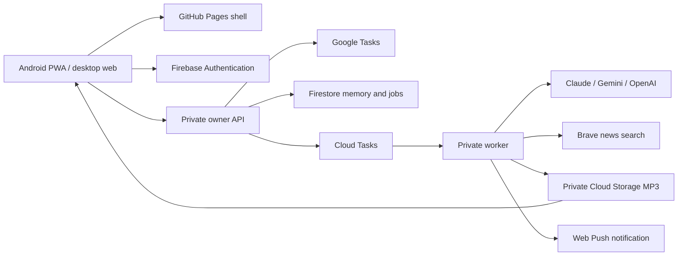

# Implementation notes

## Boundaries

The React frontend is a static, installable PWA. It has no provider credentials. `VITE_APP_MODE` selects an isolated fictional browser preview, a loopback development API, or the authenticated cloud API. Local authentication is deliberately rejected by the production build. Hash-based navigation supports GitHub Pages repository paths without rewrite rules.

The Express API and worker use the same container with separate Cloud Run services. API routes require a Firebase token whose UID matches the configured owner. Internal job routes verify an OIDC token from the configured job service account. The worker also has Cloud Run IAM protection. This is a single-owner application, not a multi-tenant service.

## Data model

The shared TypeScript types are in `packages/domain/src/types.ts`; input schemas are in `schemas.ts`. Cloud documents live under `owners/{OWNER_UID}/{collection}/{id}`. The local adapter uses one atomic JSON file and serialises writes within a process.

| Collection | Content and lifecycle |
| --- | --- |
| `memories` | Goals, people, relationships, issues, decisions, preferences and events. Text, certainty, status, importance, tags, links, source ID, review state, merge provenance and optimistic version. Kept until deleted. |
| `vectors` | Optional 768-dimensional Gemini embeddings, stored both as the searchable index field and as a plain array so memories can be compared with each other for duplicate review. Deleted with their memory. |
| `snapshots` | Selected Google Tasks and list metadata from the last successful sync. Old app coaching logs are excluded from the normalised context. |
| `proposals` | Suggested/new actions. Pending → creating → accepted, dismissed or uncertain. |
| `captures` | Temporary typed input or recording pointer, processing state, learned IDs and response. Raw audio removed after processing; default transcript removal is immediate. |
| `episodes` | Mix, script, provenance, task sync time, memory revision, status, audio pointer/checksum and expiry. |
| `jobs`, `job_inputs`, `job_steps` | Durable work, leases, dispatch intent, temporary inputs and completed speech chunks. No recording data in the Cloud Tasks request itself. |
| `budget` | One ledger per owner month, containing spend, reservations and settled request IDs. |
| `connections`, `oauth` | Encrypted Google refresh token and short-lived one-use OAuth state/PKCE verifier. |
| `devices` | Push subscription endpoints and keys. Notification contents remain generic. |
| `backups`, `deletions` | Encrypted snapshot metadata and deletion tombstones. |
| `templates`, `settings`, `feedback`, `meta` | Reusable audio mixes, preferences, recent coaching feedback and revision/retention counters. |

This implementation targets a personal workspace. The Firestore adapter lists collections with pagination; snapshots and budget ledgers still use single documents. Very large task lists or years of dense use need partitioned snapshots and an archival strategy before approaching Firestore document limits. Briefing context is deliberately bounded (up to 18 memories and 60 open tasks); the model is told its task coverage. Capture is not bounded in the same way: a note contributes as many memories as it supports, and each is rated 1–3 for importance so retrieval — not extraction — decides what reaches a briefing. There is no claim that every memory or task appears in every briefing.

## Remembering and correcting

1. The browser records compressed audio in two-second pieces in IndexedDB. A navigation interruption stops the recorder and leaves recoverable pieces. The original is removed from the browser after the server accepts it; failed uploads remain locally available.
2. The worker transcribes with Gemini. A "remember" note then goes through two passes. **Extraction** (the memory model, Claude or Gemini) records what the user said: it separates personal claims from assistant hypotheses and requires supporting evidence quoted from the current input. Punctuation the model tidies while copying is tolerated; a quote whose words are not in the note is not. Dropped candidates are counted and logged, so a thin result can be told apart from a strict filter. Exact repeats are deduplicated against retrieved memories.
3. New understanding is stored as memories, and a note that revises something already known updates that record in place rather than stacking a near-duplicate beside it. It does not automatically rewrite older user-corrected facts: an inferred revision to a memory the user edited is refused, and the note may only add a separate memory. A model-driven revision keeps its existing certainty and returns to the review queue. Ambiguous changes can coexist until reviewed; certainty and time remain visible. The “What I learned” card lets you inspect and edit them.
4. **Reflection** (the advice model, on by default) is the adviser reading the note against the whole profile — every memory the user rated core, what the note pulls in by topic, what has been touched in the last fortnight, the hypotheses it formed before, and open tasks in priority order — and saying what it means: the problem under the words, a repeating pattern or psychological barrier, a risk building, an opportunity not taken, and the one move to make. Its findings are stored as `pattern`, `risk`, `opportunity` or `issue` memories with `assistant_hypothesis` certainty, unreviewed, each linked to the memories and tasks it rests on; a finding with no basis in the packet is dropped. A conclusion reached again updates the earlier hypothesis rather than duplicating it. Its reply becomes the response to the note. If it fails, the note still completes with the facts saved and says so. The same profile feeds the adviser chat and the briefing, so core memories are always in front of the coach.
5. **Research** (optional, off by default) runs when reflection decides something is worth looking up. The adviser writes impersonal queries; only those queries reach the search provider, on the same fixed host as the news module. The note, the memories and anything identifying never leave. A second pass reads the results back — treating them as untrusted web text, not instruction or fact — and adds what it found to the reply with its sources. A failed or unconfigured search leaves the coaching untouched.
6. **The standing review** is the one pass no user action starts. On its own cadence (weekly by default, or on demand from Memory) the adviser re-reads the whole store with no note in front of it, looking for what no single note shows: themes across months, goals that have gone quiet, contradictions, and its own earlier conclusions the evidence has since undercut. It may add syntheses, re-rate importance, mark things resolved, withdraw its own hypotheses, and nominate duplicates. It may **not** rewrite the words of a user memory, and it may not touch anything the user corrected. A withdrawn conclusion is resolved with its reason appended, never deleted. It runs only when something changed since the last one, and everything it produces lands unreviewed for confirmation.
7. Memories that say close to the same thing are shortlisted for review by embedding similarity, or by word overlap where no embedding exists. Nothing merges automatically. A confirmed merge keeps the oldest record so existing references still resolve, takes the strongest importance, status and pin of the set, repoints briefings, captures, links and suggestions at the survivor, and returns it for review. Unlike a deletion it leaves no tombstone: the shared source note is still valid.
8. A direct edit must carry the current version. A conflicting edit is rejected. Correcting or deleting supporting memories invalidates existing audio; deletion also removes derived transcripts and files. Offline devices receive that change on their next successful reconnect.
9. Temporary chat does not extract memories or create task proposals. Its conversation history lives in React state and disappears on leaving the screen. Temporary audio has short-lived processing storage and a reply, which expires; no memory extraction occurs.

These controls reduce fabricated personal claims; they do not prove semantic accuracy. The LLM can misunderstand speech, confuse an inference with a fact or overstate advice. Editable memories, visible certainty, source links, bounded context and factual checking are intentional product controls.

## Google Tasks compatibility

Native Google child tasks retain their `parent` field and are rendered separately from the original app's embedded checklist. The original delimiter is preserved exactly, including the em dash. Checklist changes round-trip user note prefixes, unknown JSON fields, checklist IDs and old history fields without truncating them. Malformed metadata and oversized notes cause an explicit refusal.

Sync follows all pagination tokens and includes completed/hidden tasks. Steadier reads a fresh task before editing, compares the displayed ETag, and sends only changed fields with `If-Match`. It then refreshes the local task snapshot. Your old app can still overwrite a concurrent edit if its own write protocol lacks equivalent checks; this cannot be fixed from the new repository.

All creations go through a proposal and an explicit approval action. The proposal is claimed atomically before the Google insert. If the response is lost, its outcome is marked uncertain and is not automatically inserted again. Check Google Tasks before creating a replacement. Old task coaching history is preserved inside Google notes but not imported as second-brain memory.

## Audio jobs

Generation reserves budget, persists the episode and dispatch intent, then submits a Cloud Task. The maintenance sweep repairs queued dispatches. A job lease prevents duplicate simultaneous work; expired work has bounded recovery attempts. The raw job request contains only its identifier.

Before writing, a personal briefing refreshes Google Tasks. Missing task access stops the job rather than pretending to have current actions. News-only briefings can run without private task context. News failures are represented as unavailable; there is no invented fallback headline.

The selected adviser writes structured sections for the requested subjects. Reference IDs must belong to the provided packet; a separate Gemini check rejects unsupported personal/news details. The verified script is checkpointed. A resumed job can reuse it if its memory revision is still valid. Speech is generated in bounded chunks with up to three concurrent requests, with content hashes protecting against reuse of mismatched chunks.

FFmpeg converts the pieces to one mono MP3, measures the encoded duration and finalises the file before publication. A SHA-256 checksum validates downloads. Context and cancellation are checked again before exposing audio. There are no fabricated chapter timestamps: chapters are currently empty because precise section boundary alignment has not been implemented.

The player uses a persistent HTML audio element, local downloaded Blobs, stored playback position and Media Session handlers. Downloads are separate from the service-worker asset cache. Playback is initiated by the user, including after a ready notification. The app cannot force Android to keep a terminated browser process alive.

## Security and deployment

- Exact frontend origin checks, authenticated mutations, schema validation, request-size limits and a per-minute API rate limit.
- Owner-only Firebase authentication; no direct browser Firestore access. Browser tokens are not provider keys.
- AES-256-GCM for Google refresh tokens and application backups. Cloud provider keys are in pre-created Secret Manager containers; local keys are encrypted in the server store.
- Private buckets, bounded signed URLs, disabled bucket soft deletion and raw-input cleanup. No API body logging in the application.
- HTTPS-only citation links and fixed provider API hosts. Neither the news adapter nor research fetches arbitrary article URLs or sends memories to search: research transmits only the impersonal query the adviser wrote, and is off by default.
- Generic notification content. On sign-out, downloaded audio and draft files are cleared from the browser.
- The service worker caches only versioned application assets and the non-personal sample narration. API responses never enter Cache Storage. Each build changes the worker version, and activation waits for old tabs to close.

Cloud encryption at rest is not end-to-end encryption: the worker and selected AI providers must see the context they process. Provider account retention and training policies remain external to this application.

## Budget accounting

Known model prices are versioned in the shared domain module. Settings reject unpriced advice and speech model IDs. Reservations and settlements are atomic and idempotent. The ledger uses the user's timezone; a job settles against its original reservation month even if it crosses midnight/month end.

Audio/capture jobs currently settle conservatively at their reserved estimate; text chat uses reported token counts. Interrupted provider calls can have unknown charges. Parallel jobs, provider minimums, changed prices, unexpectedly long generated speech, embedding calls and external subscriptions mean this meter cannot enforce a hard cap on invoices. Use provider billing limits and review actual invoices during the first month. The budget UI explains this limitation.

Current provider adapters use the [Anthropic Messages API](https://platform.claude.com/docs/en/api/messages), [Gemini content and speech generation](https://ai.google.dev/gemini-api/docs/speech-generation), [Google Cloud TTS](https://docs.cloud.google.com/text-to-speech/docs/gemini-tts), and OpenAI chat/speech endpoints. Model names and prices are checked-in policy; update them with their official documentation before adding new choices.
